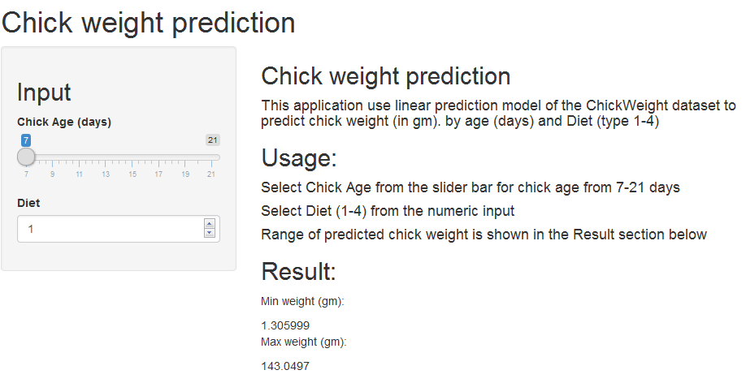

Developing Data Products Project
========================================================
author: Calvin Chu
date: 6/3/2016

Introduction
========================================================

This project built a chick weight prediction application from the ChickWeight dataset. A linear prediction model is built to predict chick weight by age and diet.
- Weight
    - Weight of chick measured in gm
- Time
    - The number of days since birth when the measurement was made
- Diet
    - A factor with levels 1-4 indicating which experimental diet the chick received.

Prediction Model
========================================================

The prediction model is built with the lm() function against the ChickWeight dataset, with Time and Diet as predictor. The linear model is then used to predict the possible range of chick weight with the input Time(Age) and Diet

```r
chick.lm = lm(weight~Time+Diet, data=ChickWeight)
predictChickWeight <- function (chickAge, diet) {
    df <- ChickWeight[1,c(2,4)] 
    df$Time <- chickAge
    df$Diet <- diet

    predict(chick.lm, df, interval="predict")
}
```

Usage of the application
========================================================
The application can be used to predict chick weight with Time (Age in days) and Diet of the chick.


Usage of the application - Cont.
========================================================
1. Select Chick Age (in days) from the slider bar for chick age from 7-21 days
    - From the prediction model minimal age would be negative for certain diet if time is less than 7, so miminal age is 7.
2. Select a Diet from 1-4
3. The predicted minimum and maximum weight would be shown in the Result section once the input is updated.
